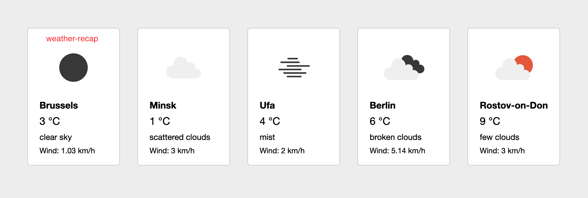
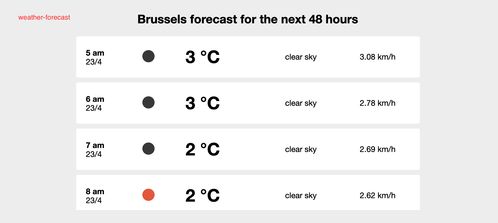

# ForecastApp

This project was generated with [Angular CLI](https://github.com/angular/angular-cli) version 11.2.10.

## Development server

Run `ng serve` for a dev server. Navigate to `http://localhost:4200/`.

## Running unit tests

Run `ng test` to execute the unit tests via [Karma](https://karma-runner.github.io).

## App features

1.  After page load, 5 random cities are generated from a list of european cities, then for every city, a request is sent to OpenWeatherMap API to retrieve its weather details.
2.  When a city card is clicked, then forecast data for the next 48 hours is displayed for that city.

## App Architecture

- **src/app/services/weather/weather.service.ts**

  This service contains a function `getCitiesWeather` which generates 5 random european cities, then for every generated city it calls `getCityWeather` which consumes **openWeatherMap API** to get that city's weather data.

- **src/app/app.component.ts**:

  This is the main component which uses the service `weatherService` to get cities weather data (as explained above), then it exposes that data to its children components: `weather-forecast` and `weather-recap`

- **src/app/components/weather-recap/weather-recap.component.ts** (`weather-recap`)

  This component displays a recap of a city weather data.

  

- **src/app/components/weather-forecast/weather-forecast.component.ts**

  This component displays 48 hours weather forecast for a particular city.

  
